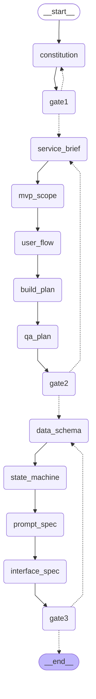

# 하네스 워크플로우 그래프

`src/graph.py` 의 `HARNESS_GRAPH` 가 컴파일하는 LangGraph StateGraph 구조.
이 파일의 다이어그램은 `HARNESS_GRAPH.get_graph().draw_mermaid()` 로 자동 생성된다.
변경 시 다음 명령으로 재생성:

```bash
uv run python -c "from src.graph import HARNESS_GRAPH; print(HARNESS_GRAPH.get_graph().draw_mermaid())"
```

## 다이어그램



조건부 분기 의미:

- `gate1`:
  `FAIL` → `constitution`
  `PASS`, `CONDITIONAL_PASS` → `service_brief`
- `gate2`:
  `FAIL` → `service_brief`
  `PASS`, `CONDITIONAL_PASS` → `data_schema`
- `gate3`:
  `FAIL` → `data_schema`
  `PASS`, `CONDITIONAL_PASS` → `END`

## 노드 책임

| 노드 | 담당 Agent | 산출물 / 결과 |
|---|---|---|
| `constitution` | Edu Agent | `constitution.md` (헌법 7항목) |
| `gate1` | Orchestrator + PM + Tech | 헌법 다중 검증 + retry_count / conditional_pass 처리 |
| `service_brief` | PM Agent | `service_brief.md` |
| `mvp_scope` | PM Agent | `mvp_scope.md` |
| `user_flow` | PM Agent | `user_flow.md` |
| `build_plan` | Tech Agent | `build_plan.md` |
| `qa_plan` | PM Agent | `qa_plan.md` |
| `gate2` | Orchestrator + Edu + Tech | 기획문서 5종 다중 검증 + retry_count / conditional_pass 처리 |
| `data_schema` | PM Agent | `data_schema.json` (입출력 필드 + mode) |
| `state_machine` | PM Agent | `state_machine.md` (상태 전이 + mode 매핑) |
| `prompt_spec` | Prompt Agent | `prompt_spec.md` (헌법 ④⑤⑥⑦ → 프롬프트 변환) |
| `interface_spec` | PM Agent | `interface_spec.md` (API / UI / 모듈 계약서) |
| `gate3` | Orchestrator | 구현 명세서 4종 검증 + retry_count / conditional_pass 처리 |

## State 구조 (TypedDict)

`src/graph.py` 의 `HarnessState`:

| 필드 | 타입 | 채워지는 시점 |
|---|---|---|
| `harness_input` | `HarnessInput` | 그래프 시작 |
| `constitution_md` | `str` | constitution / gate1 (재작성 시) |
| `gate1_result` | `Gate1Result` | gate1 |
| `gate1_retry_count` | `int` | gate1 |
| `gate1_risk_memo` | `str` | gate1 (2회차 fail 시) |
| `service_brief_md` | `str` | service_brief |
| `mvp_scope_md` | `str` | mvp_scope |
| `user_flow_md` | `str` | user_flow |
| `build_plan_md` | `str` | build_plan |
| `qa_plan_md` | `str` | qa_plan |
| `gate2_result` | `Gate2Result` | gate2 |
| `gate2_retry_count` | `int` | gate2 |
| `gate2_risk_memo` | `str` | gate2 (2회차 fail 시) |
| `data_schema_json` | `str` | data_schema |
| `state_machine_md` | `str` | state_machine |
| `prompt_spec_md` | `str` | prompt_spec |
| `interface_spec_md` | `str` | interface_spec |
| `gate3_result` | `Gate3Result` | gate3 |
| `gate3_retry_count` | `int` | gate3 |
| `gate3_risk_memo` | `str` | gate3 (2회차 fail 시) |
