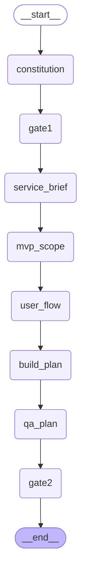

# 하네스 워크플로우 그래프

`src/graph.py` 의 `HARNESS_GRAPH` 가 컴파일하는 LangGraph StateGraph 구조.
이 파일의 다이어그램은 `HARNESS_GRAPH.get_graph().draw_mermaid()` 로 자동 생성된다.
변경 시 다음 명령으로 재생성:

```bash
uv run python -c "from src.graph import HARNESS_GRAPH; print(HARNESS_GRAPH.get_graph().draw_mermaid())"
```

## 다이어그램



## 노드 책임

| 노드 | 담당 Agent | 산출물 / 결과 |
|---|---|---|
| `constitution` | Edu Agent | `constitution.md` (헌법 7항목) |
| `gate1` | Orchestrator | 헌법 검증 (4항목) |
| `service_brief` | PM Agent | `service_brief.md` |
| `mvp_scope` | PM Agent | `mvp_scope.md` |
| `user_flow` | PM Agent | `user_flow.md` |
| `build_plan` | Tech Agent | `build_plan.md` |
| `qa_plan` | PM Agent | `qa_plan.md` |
| `gate2` | Orchestrator + Edu + Tech | 기획문서 5종 다중 검증 (4 + 2 + 2 항목) |

## State 구조 (TypedDict)

`src/graph.py` 의 `HarnessState`:

| 필드 | 타입 | 채워지는 시점 |
|---|---|---|
| `harness_input` | `HarnessInput` | 그래프 시작 |
| `constitution_md` | `str` | constitution / gate1 (재작성 시) |
| `gate1_result` | `Gate1Result` | gate1 |
| `service_brief_md` | `str` | service_brief |
| `mvp_scope_md` | `str` | mvp_scope |
| `user_flow_md` | `str` | user_flow |
| `build_plan_md` | `str` | build_plan |
| `qa_plan_md` | `str` | qa_plan |
| `gate2_result` | `Gate2Result` | gate2 |